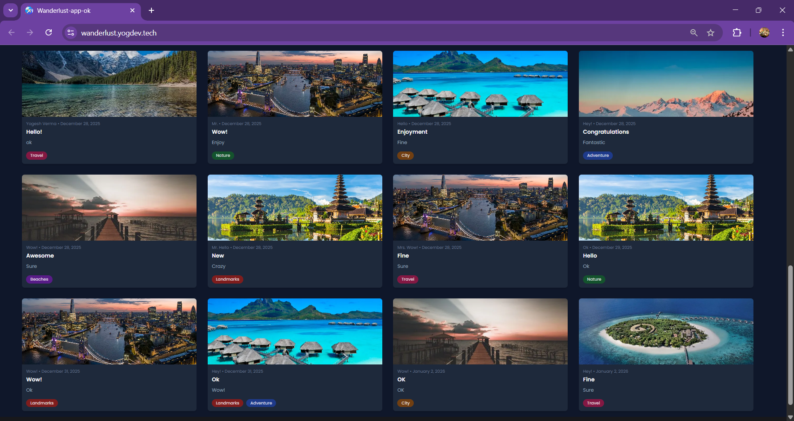
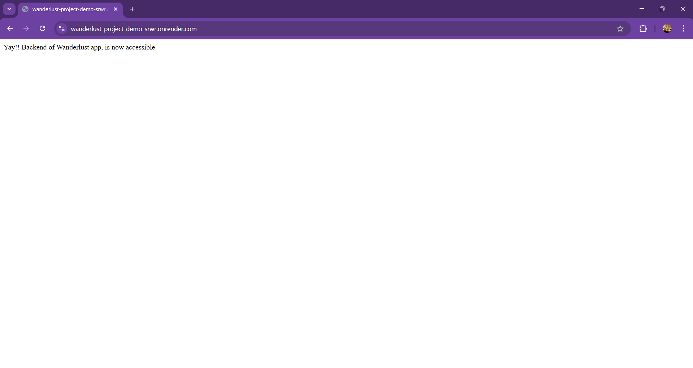
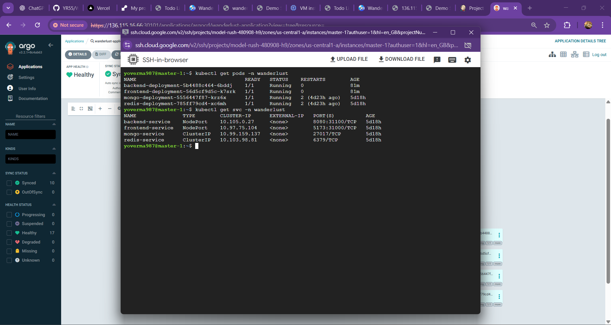

# Wanderlust – DevOps & DevSecOps Enabled Travel Blog Platform 🌍🚀

Wanderlust is a **full-stack MERN application** deployed using **modern DevOps and GitOps practices**.  
This project focuses on **real-world deployment workflows**, CI/CD automation, containerization, and cloud-native architecture rather than just application development.

#

🔗 **Frontend (Live UI)**  
https://wanderlust.yogdev.tech/

🔗 **Backend (Live API)**  
https://wanderlust-project-demo-srwr.onrender.com

---

## 1️⃣ Deployment Flow (DevOps Architecture)

This project follows an **end-to-end DevOps + GitOps deployment flow**, starting from source code to production deployment.

> 

**High-level flow:**
- Code pushed to GitHub
- Jenkins CI pipeline builds & validates the application
- Docker images created and pushed to registry
- GitOps manifests updated
- ArgoCD continuously syncs and deploys to Kubernetes
- Application exposed via cloud infrastructure

This setup simulates a **production-grade deployment pipeline** used in real organizations.

---

## 2️⃣ Tech Stack Used in This Project

### Application Stack
- React (Frontend)
- Node.js & Express (Backend)
- MongoDB Atlas (Database)
- Redis (Caching)

### DevOps & Cloud Stack
- Docker & Docker Compose
- Jenkins (CI & CD Pipelines)
- GitHub (Source Control)
- ArgoCD (GitOps Continuous Deployment)
- Kubernetes (Manifests included)
- Terraform (Infrastructure as Code – reference)
- OWASP Dependency Check
- SonarQube (Code Quality)
- Trivy (Security Scanning)

---

## 3️⃣ Project Demo & Screenshots

This section contains **real screenshots from the deployed project**, covering different stages of the application and DevOps workflow.

### 🔹 Frontend UI (Live Website)

---

### 🔹 Backend API Responses

---

### 🔹 Jenkins CI & CD Pipelines

---

### 🔹 ArgoCD Application Sync Status

---

### 🔹 Kubernetes Resources Running in Cluster

---

> 📌 *(These screenshots represent the actual running system, not a mock or sample setup.)*
---

## 4️⃣ Real-World DevOps Experience Gained

This project was **highly valuable for gaining practical DevOps experience**, covering scenarios commonly faced in real environments:

- Designing and implementing **end-to-end CI/CD pipelines**
- Working with **Dockerized applications** in production-like setups
- Managing **GitOps-based deployments** using ArgoCD
- Understanding **Kubernetes manifests, services, and workloads**
- Handling **environment variables, secrets, and configs**
- Observing deployment failures, rollbacks, and sync states
- Improving reliability through **automation and version control**

Overall, this project helped bridge the gap between **theoretical DevOps concepts and real-world implementation**.
